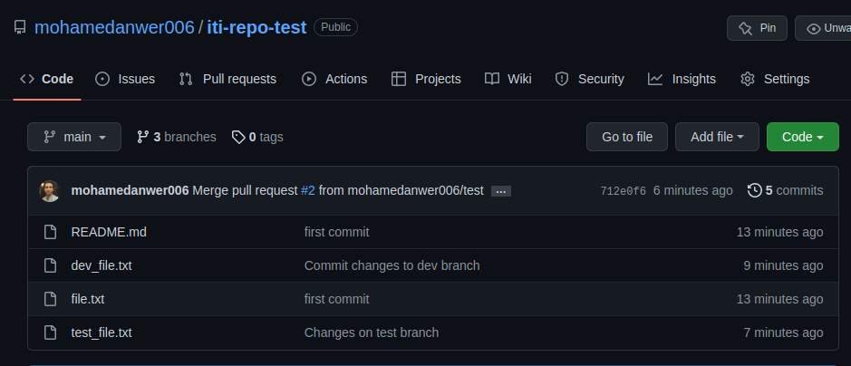

# ITI git lab 2

## remove dev branch on remote

```
git push origin -d dev
```

## remove dev branch locally

```
git branch -d dev
```

## list tag

```
git tag --list
```

## delete tag locally

```
git tag -d v1.7
```

## delete tag remotely

```
git push --delete origin  v1.7
```


)